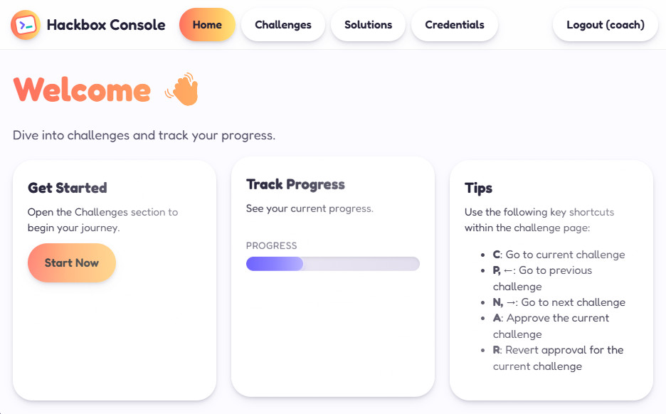
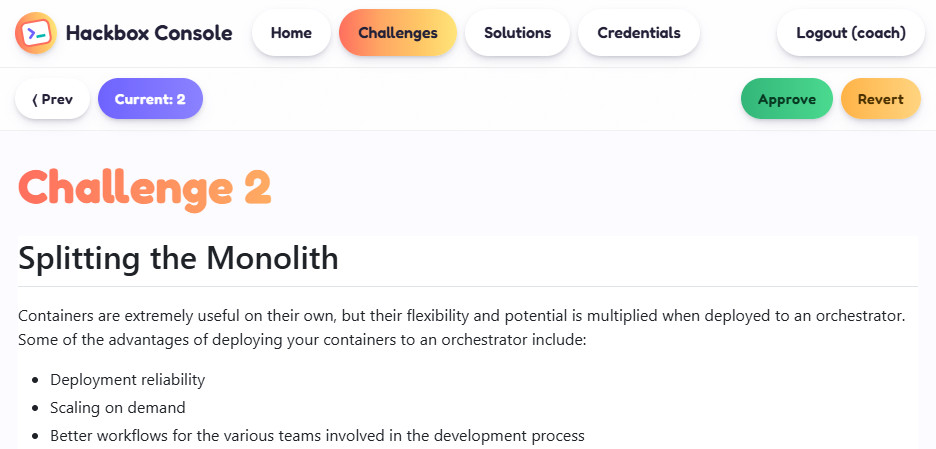

# HackBox Console

> [!NOTE]  
> Comes with support for:
> - Microsoft [WhatTheHack](documentation/WhatTheHack/README.md)
> - Microsoft [MicroHack](documentation/MicroHack/README.md)






A portal for **Hackathon participants** to access challenges and credentials.

A portal for **Hackathon coaches** to access challenges, solutions, credentials and unlock challenges for participants.

The HackBox Console also supports multitenancy (multiple teams with a single coach each) and can be integrated with other tools, that take care of the sandbox environment provisioning.

Solutions and challenges are stored in markdown files.
  * challanges should follow the format: ``challenge-*.md``, f.e. ``challenge-1.md``, ``challenge-2.md``, ...
  * solutions should follow the format:  ``solution-*.md``, f.e. ``solution-1.md``, ``solution-2.md``, ...

Thanks to [zero-md](https://github.com/zerodevx/zero-md) the markdown files are rendered as HTML with a broad support for markdown syntax:
- [x] Math rendering via [`KaTeX`](https://github.com/KaTeX/KaTeX)
- [x] [`Mermaid`](https://github.com/mermaid-js/mermaid) diagrams
- [x] Syntax highlighting via [`highlight.js`](https://github.com/highlightjs/highlight.js)
- [x] Language detection for un-hinted code blocks
- [x] Hash-link scroll handling
- [x] FOUC prevention
- [x] Auto re-render on input changes
- [x] Light and dark themes
- [x] Spec-compliant extensibility


## How to build & Deploy

Have a directory containing the challenges. It will walk through the directory (including subdirectories) and look for files named ``*challenge*.md``.
Have a directory containing the solutions. It will walk through the directory (including subdirectories) and look for files named ``*solution*.md``.


Deploy the console with the markdown files from the ContosoHotelOpenHack repository
Either run for a single tenant (one team, one coach)
```pwsh
# for single tenant run:
.\iac\deployHackerConsole.ps1 `
    -SourceChallengesDir ..\ContosoHotelOpenHack\challenges\ `
    -SourceSolutionsDir ..\ContosoHotelOpenHack\solutions\ `
    -hackerUsername "hacker" `
    -hackerPassword ("hacker" | ConvertTo-SecureString -AsPlainText -Force) `
    -coachUsername "coach" `
    -coachPassword ("coach" | ConvertTo-SecureString -AsPlainText -Force)
```
Or run for multiple tenants (multiple teams with one coach each)
```pwsh
# for multi tenant create the users.json first
.\iac\createUsers.ps1 -numberOfTenants 3 -baseHackerUsername "hacker" -baseCoachUsername "coach"
# for multi tenant run:
.\iac\deployHackerConsole.ps1 `
    -SourceChallengesDir ..\ContosoHotelOpenHack\challenges\ `
    -SourceSolutionsDir ..\ContosoHotelOpenHack\solutions\
```

Publish additional credentials to the storage account in this example the name of the credential is ``Example Password`` with the (secret) value ``DontTellAnyone``
```pwsh
.\iac\addCredential.ps1 `
    -storageAccountName "storage...." `
    -name "Example Password" `
    -value "DontTellAnyone"
# for multi tenant please also add: -tenant "team1"
```

In addtion, you can also add multiple credentials from a json or csv file:
```pwsh
# for csv with required columns: name, value   (optional columns: group, tenant)
Get-Content .\creds.csv | ConvertFrom-Csv | .\iac\addMultipleCredentails.ps1 -storageAccountName remsa001 -storageAccountName "storage...."
# for json array of objects with required attributes: name, value   (optional attributes: group, tenant)
Get-Content .\creds.json | ConvertFrom-Json | .\iac\addMultipleCredentails.ps1 -storageAccountName remsa001 -storageAccountName "storage...." 
```
